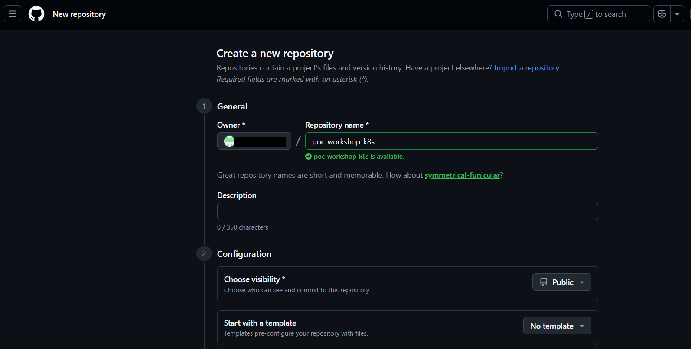
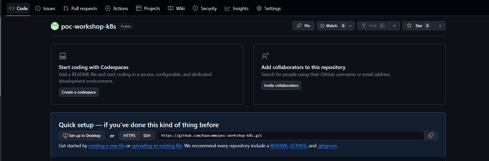
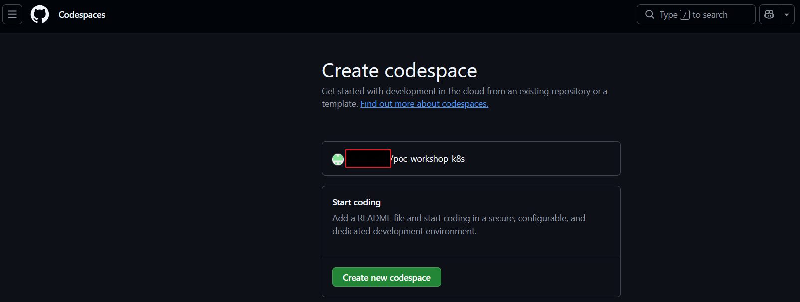

# workshop-k8s
workshop-k8s

# สิ่งที่ต้องเตรียม ()
## 1. ถ้าจะใช้ Github Codespace
กรณีถ้ายังไม่มี github สามารถเข้าไปสมัครได้ที่ (ต้องใช้ CMU ACCOUNT ในการลงทะเบียนเท่านั้น ใน FORM นี้) =>  [ลงทะเบียนใช้งาน GitHub Enterprise for CMU](https://forms.office.com/pages/responsepage.aspx?id=3_GBz1neKUyR2qLf0EqnUfWFICr-s69FptDpdUKDz5hUMUE2UUVFTTlNMDQwVU9LTFc0VlAzTE80MC4u&route=shorturl)

## 2. Create a Git Repository



## 3. Open in Codespaces



## 4. Create a Codespace


```
# x86_64
curl -Lo ./kind https://kind.sigs.k8s.io/dl/v0.31.0/kind-linux-amd64
chmod +x ./kind
sudo mv ./kind /usr/local/bin/kind


# Install kubectl
curl -LO "https://dl.k8s.io/release/v1.35.0/bin/linux/amd64/kubectl"
chmod +x kubectl
sudo mv kubectl /usr/local/bin/
kubectl version --client --short


# Install Trivy
curl -sfL https://raw.githubusercontent.com/aquasecurity/trivy/main/contrib/install.sh | sudo sh -s -- -b /usr/local/bin v0.69.0


git clone https://github.com/watcharap0ng/workshop-k8s.git

# create cluster
cd workshop-k8s/kind
kind create cluster --config=config.yml


# Verify

kubectl cluster-info --context kind-kind
kubectl get nodes
```

## ถ้าจะใช้เครื่องของตัวเอง Windows (LABTOP)
```
# ติดตั้ง WSL2 + Ubuntu
wsl --install -d Ubuntu-22.04
wsl --set-default-version 2

# ติดตั้ง Docker Desktop (Windows)
ดาวน์โหลด Docker Desktop https://www.docker.com/products/docker-desktop/


# x86_64
curl -Lo ./kind https://kind.sigs.k8s.io/dl/v0.31.0/kind-linux-amd64
chmod +x ./kind
sudo mv ./kind /usr/local/bin/kind


# Install kubectl
curl -LO "https://dl.k8s.io/release/v1.35.0/bin/linux/amd64/kubectl"
chmod +x kubectl
sudo mv kubectl /usr/local/bin/
kubectl version --client --short

# Install Trivy
curl -sfL https://raw.githubusercontent.com/aquasecurity/trivy/main/contrib/install.sh | sudo sh -s -- -b /usr/local/bin v0.69.0

git clone https://github.com/watcharap0ng/workshop-k8s.git

# create cluster
cd workshop-k8s/kind
kind create cluster --config=config.yml


# Verify
kubectl cluster-info --context kind-kind
kubectl get nodes
```

## ถ้าจะใช้เครื่องของตัวเอง macOS (LABTOP)
```
# Install kind
brew install kind

# Install kubectl
brew install kubectl

# Install trivy
brew install trivy

# ติดตั้ง Docker Desktop (macOS)
ดาวน์โหลด Docker Desktop https://www.docker.com/products/docker-desktop/


git clone https://github.com/watcharap0ng/workshop-k8s.git

# create cluster
cd workshop-k8s/kind
kind create cluster --config=config.yml

# Verify
kubectl cluster-info --context kind-kind
kubectl get nodes
```